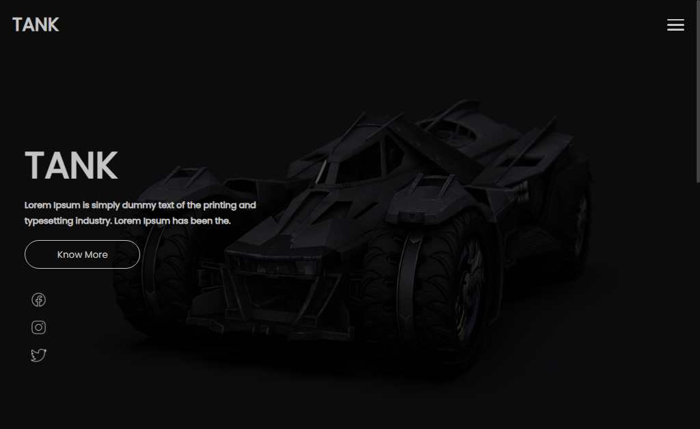

# TANK

> Tank

O projeto TANK foi criado por mim com o intuito de praticar ReactJS.

[Clique para acessar](https://guimiiller.github.io/tank_react/)

## 🚀 Tecnologias

- ReactJS

## 💻 O que aprendi

- Melhorei minhas habilidades em styled-components
- Aprendi a criar um modal para os carros
- Pratiquei e aprendi mais sobre React Router

## 📨 Contato

- guilhermemillerblack@gmail.com